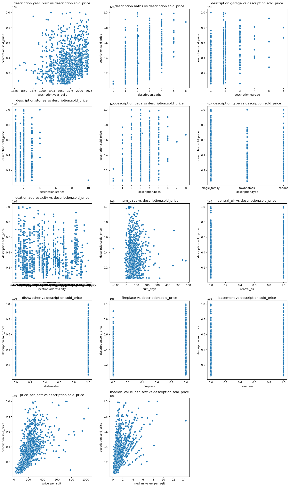
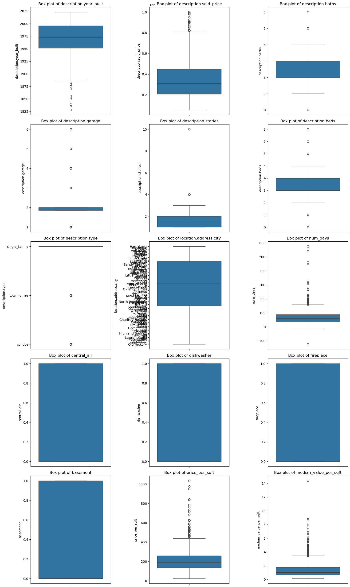

# 🏡 House Price Prediction Model

## 📌 Project Overview
This project focuses on predicting house sale prices using machine learning techniques. We collected and processed real estate data, performed extensive exploratory data analysis (EDA), engineered meaningful features, and experimented with multiple machine learning models to optimize predictive performance.

---

## 🎯 Goals
- **Data Cleaning & Processing**: Handle missing values, remove outliers, and standardize features.
- **Feature Engineering**: Create new features to enhance model predictions.
- **Model Selection**: Train multiple machine learning models and select the best one.
- **Evaluation**: Compare model performance using key regression metrics.

---

## 🔄 Process

### 📂 Data Preprocessing & Feature Engineering

1. **Data Collection & Cleaning**
   - Loaded `.json` files and converted them into a structured Pandas DataFrame.
   - Normalized nested JSON structures to extract useful attributes.
   - Dropped irrelevant, highly correlated, or redundant features.
   - Removed outliers using the **5th and 95th percentiles** of `sold_price`.
   - Imputed missing values using:
     - **KNN Imputer** for numerical values like `sqft` and `year_built`.
     - **Mean Imputation** for features like `beds`, `garage`, `stories`, and `baths`.

2. **Feature Engineering**
   - **New Features Created:**
     - `price_per_sqft`: Sold price divided by square footage.
     - `median_value_per_sqft`: Adjusted for city-level median home values.
   - **Encoding:**
     - Categorical variables were transformed using **Label Encoding**.
     - Cities were encoded using a **custom Label Encoder** to handle unseen values.
   - **Feature Selection:**
     - Dropped weak or redundant features based on correlation and importance.
   - **Dimensionality Reduction:**
     - Applied **Principal Component Analysis (PCA)** to retain 95% of variance.

---

### 📊 Exploratory Data Analysis (EDA)
To better understand the dataset, we conducted **visual analysis**:

- **Scatterplot**: Visualizing correlations between numerical features and `sold_price`.  
  

- **Boxplot**: Identifying potential outliers and distribution trends.  
  

- **Feature Importance**: Showing the most influential variables in the model.  
  

---

## 🤖 Model Selection & Evaluation
We experimented with different datasets and transformations, including:
- **Unprocessed data**
- **Polynomial features**
- **PCA-transformed data**
- **Polynomial + Scaled + PCA data**

### ✅ Best Performing Model: **Gradient Boosting Regressor**
- **Best Hyperparameters:**  
  `{ 'learning_rate': 0.1, 'max_depth': 3, 'min_samples_leaf': 2, 'min_samples_split': 5, 'n_estimators': 300, 'subsample': 0.8 }`
- **Performance Metrics:**
  - **Mean Squared Error (MSE):** 6,399,959,654.03
  - **Root Mean Squared Error (RMSE):** 79,999.75
  - **Mean Absolute Error (MAE):** 55,246.17
  - **R² Score:** 0.816
  - **Adjusted R² Score:** 0.8039

### 🔥 Other Models Tested
#### XGBoost:
- **MSE:** 6,466,147,328.0
- **RMSE:** 80,412.36
- **MAE:** 57,161.27
- **R² Score:** 0.8141
- **Adjusted R² Score:** 0.8019

#### Random Forest:
- **Best Hyperparameters:**  
  `{ 'bootstrap': True, 'max_features': 0.5, 'min_samples_leaf': 1, 'min_samples_split': 2, 'n_estimators': 200 }`
- **Performance Metrics:**
  - **Mean Absolute Error (MAE):** 64,223.21
  - **R² Score:** 0.8089
  - **Adjusted R² Score:** 0.7963

---

## 🚧 Challenges
- **Handling missing values:** Certain attributes had too many missing values and required imputation.
- **High-dimensional data:** Reducing unnecessary features was crucial to improving performance.
- **Outliers:** Needed careful filtering of extreme price values.

---

## 🚀 Future Improvements

---

📌 **Conclusion:** The Gradient Boosting model provided the best predictive accuracy, but there is room for further improvement through advanced hyperparameter tuning and feature selection.
